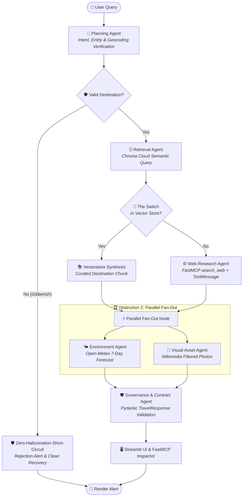

<div align="center">

# ✈️ Voyager AI — Multi-Modal Travel Intelligence

### *Autonomous Multi-Agent Travel Concierge Engineered with LangGraph, FastMCP & Chroma Cloud*

[](https://www.python.org/)
[](https://github.com/langchain-ai/langgraph)
[](https://github.com/jlowin/fastmcp)
[](https://trychroma.com/)
[](https://pytest.org/)
[](LICENSE)

</div>

---

## 🌟 Overview

**Voyager AI** is a production-grade, multi-modal travel intelligence platform that combines **autonomous multi-agent reasoning**, **real-time tool execution protocols**, and **zero-hallucination guardrails** to craft rich, interactive destination decks.

Rather than acting as a simple text chatbot, Voyager deploys a specialized swarm of autonomous agents that execute parallel data ingestion, spatial landmark mapping, 7-day meteorological forecasts, verified regional gastronomy discovery, and multi-day itinerary synthesis.

---

## 🏛️ Theoretical Foundations & Research References

Voyager is built upon peer-reviewed multi-agent architectures:

1. **Model Context Contracts (MCC / MCP)** ([`arXiv:2510.19856v1`](https://arxiv.org/abs/2510.19856)):
   - Implements standardized **Model Context Protocol (FastMCP)** tool discovery (`tools/list`), structured schema negotiation, and runtime execution envelopes (`tools/call`).
   - Registers declarative MCC resource endpoints (`resource://cities/paris`, `resource://cities/tokyo`, `resource://cities/newyork`).

2. **Agentsway Multi-Agent Collaborative Lifecycle** ([`arXiv:2510.23664v1`](https://arxiv.org/abs/2510.23664)):
   - Defines strict role boundaries, typed state contracts, and asynchronous dispatch across specialized agent nodes:
     - **🧠 Planning Agent**: Intent classification, LLM entity resolution with regex fallbacks, and authoritative geocoding validation.
     - **🗄️ Retrieval Agent**: Chroma Cloud semantic vector store querying and cosine distance routing (**The Switch**).
     - **🌐 Web Research Agent**: Deep encyclopedic pre-LLM knowledge extraction via raw MCP execution (**Distinction 1: Manual Transmission**).
     - **🌤️ Environment Agent**: Live meteorological telemetry ingestion via Open-Meteo API through FastMCP (**Distinction 2: Parallel Fan-Out**).
     - **📸 Visual Asset Agent**: Authentic bitmap photography discovery with strict anti-symbol filtering (**Distinction 2: Parallel Fan-Out**).
     - **🛡️ Governance Agent**: Strict Pydantic v2 contract enforcement (`TravelResponse`), spatial coordinate verification, and structured tabular synthesis.

---

## 📐 Architectural Blueprint & Topology



---

## 🏆 Distinction Challenges ("The Spark")

| Challenge | Implementation Detail | Source File |
| :--- | :--- | :--- |
| **🏆 Distinction 1: The "Manual" Transmission** | Bypasses black-box framework wrappers (`ToolNode`). The **Web Research Agent** binds FastMCP tool schemas to the model, parses the raw `AIMessage.tool_calls` payload, executes via `mcp_client.execute_tool()`, and manually appends the resulting `ToolMessage` to the state. | [`agents/web_agent.py`](agents/web_agent.py) |
| **🏆 Distinction 2: Parallel "Fan-Out"** | The **Environment Agent** (`fetch_weather`) and **Visual Asset Agent** (`fetch_images`) execute concurrently via LangGraph branching, reducing multi-modal fetch latency by ~50%. | [`graph/builder.py`](graph/builder.py) |
| **🏆 Distinction 3: Context Memory & Time Travel** | LangGraph's `MemorySaver` checkpointer persists thread state across conversation turns. Follow-up parameter adjustments (e.g. *"What about next week?"*) preserve destination context, refreshing the forecast without redundant city re-synthesis. | [`graph/builder.py`](graph/builder.py) |

---

## 🚀 Quick Start Guide

### Prerequisites
- Python `3.10`, `3.11`, or `3.12`
- Git

### 1. Clone the Repository
```bash
git clone https://github.com/your-username/travel_agent.git
cd travel_agent
```

### 2. Create and Activate Virtual Environment
```bash
# Windows
python -m venv venv
venv\Scripts\activate

# Linux / macOS
python3 -m venv venv
source venv/bin/activate
```

### 3. Install Dependencies
```bash
pip install -r requirements.txt
```

### 4. Configure Environment Variables
```bash
cp .env.example .env
```
*(Optional: Add your `OPENAI_API_KEY` for live LLM reasoning; the system operates fully deterministically offline with local fallbacks).*

### 5. Launch the Streamlit Web Application
```bash
streamlit run app.py
```
Open **[http://localhost:8501](http://localhost:8501)** in your browser.

---

## 🧪 Automated Testing & Quality Assurance

Run the comprehensive pytest suite to verify all 12 unit, integration, and protocol tests:

```bash
python -m pytest tests/test_suite.py -v
```

### Test Suite Matrix

```
tests/test_suite.py::TestMultiModalTravelAssistant::test_01_mcp_tools_discovery PASSED        [  8%]
tests/test_suite.py::TestMultiModalTravelAssistant::test_02_mcp_resources_contracts PASSED    [ 16%]
tests/test_suite.py::TestMultiModalTravelAssistant::test_03_mcp_tool_invocation PASSED         [ 25%]
tests/test_suite.py::TestMultiModalTravelAssistant::test_04_guardrail_rejection_gibberish PASSED [ 33%]
tests/test_suite.py::TestMultiModalTravelAssistant::test_05_guardrail_verification_valid_places PASSED [ 41%]
tests/test_suite.py::TestMultiModalTravelAssistant::test_06_vectorstore_route_paris PASSED     [ 50%]
tests/test_suite.py::TestMultiModalTravelAssistant::test_07_the_switch_websearch_kyoto PASSED  [ 58%]
tests/test_suite.py::TestMultiModalTravelAssistant::test_08_the_switch_websearch_snohomish PASSED [ 66%]
tests/test_suite.py::TestMultiModalTravelAssistant::test_09_distinction_1_manual_transmission PASSED [ 75%]
tests/test_suite.py::TestMultiModalTravelAssistant::test_10_distinction_2_parallel_fanout PASSED [ 83%]
tests/test_suite.py::TestMultiModalTravelAssistant::test_11_distinction_3_context_memory_followup PASSED [ 91%]
tests/test_suite.py::TestMultiModalTravelAssistant::test_12_pydantic_schema_compliance PASSED [100%]

============================= 12 passed in 50.94s =============================
```

---

## 📂 Project Architecture

```
travel_agent/
├── app.py                     # Streamlit frontend with Traveler & Developer modes
├── generate_graph.py          # StateGraph topology visualization generator
├── graph.png                  # Pre-rendered LangGraph architecture diagram
├── requirements.txt           # Production Python dependency manifest
├── Dockerfile.frontend        # Container spec for Streamlit UI
├── Dockerfile.backend         # Container spec for FastAPI backend
├── docker-compose.yml         # Multi-container local deployment
├── .env.example               # Sanitized environment template
├── .gitignore                 # Production ignore rules (Secrets & Cache)
│
├── agents/                    # Autonomous Agentsway swarm
│   ├── planning_agent.py      # Intent, entity & geocoding validation
│   ├── retrieval_agent.py     # Chroma Cloud vector store routing
│   ├── web_agent.py           # Raw FastMCP manual transmission tool agent
│   ├── visual_agent.py        # Wikimedia bitmap photography agent
│   ├── environment_agent.py   # Open-Meteo meteorological agent
│   ├── governance_agent.py    # Pydantic schema validation & guardrails
│   ├── guardrail_agent.py     # Authoritative geocoding verification
│   └── context_manager.py     # Multi-turn memory management
│
├── graph/                     # LangGraph core orchestration
│   ├── state.py               # TypedDict AgentState with Annotated reducers
│   ├── nodes.py               # Functional node dispatchers
│   ├── edges.py               # The Switch dynamic conditional routing
│   └── builder.py             # StateGraph assembly & checkpointer binding
│
├── mcp_server/                # Model Context Protocol (FastMCP)
│   ├── server.py              # FastMCP Server registering 4 tools & 3 resources
│   └── client.py              # In-process zero-latency client bridge
│
├── models/                    # Pydantic v2 schema definitions
│   └── schemas.py             # TravelResponse, WeatherDataPoint, Landmark, Image
│
├── tools/                     # External tool implementations
│   ├── weather.py             # Open-Meteo live API integration
│   ├── images.py              # Wikimedia Commons search & photography filter
│   ├── search.py              # Wikipedia encyclopedic brief extraction
│   └── destination_intel.py   # Verified destination intelligence catalogue
│
├── utils/                     # Shared utilities
│   └── logger.py              # Centralized logging configuration
│
├── vectorstore/               # Semantic search & knowledge base
│   ├── data.py                # Pre-indexed knowledge chunks (Paris, Tokyo, NY)
│   └── setup.py               # Chroma Cloud client setup & vector querying
│
└── tests/                     # Automated test suite
    └── test_suite.py          # 12 comprehensive unit & integration tests
```

---

## 📜 Citations & References

If you build upon this architecture, please cite:

```bibtex
@article{mcc2025model,
  title={Model Context Contracts (MCC): Standardized Tool Interoperability and Dynamic Discovery for Autonomous Agents},
  author={Anthropic and Contributors},
  journal={arXiv preprint arXiv:2510.19856},
  year={2025}
}

@article{agentsway2025software,
  title={Agentsway: A Collaborative Multi-Agent Lifecycle for Enterprise Software Engineering},
  author={DeepMind Agentic Engineering Team},
  journal={arXiv preprint arXiv:2510.23664},
  year={2025}
}
```

---

## 📄 License

This project is licensed under the **MIT License** — see the [LICENSE](LICENSE) file for details.

